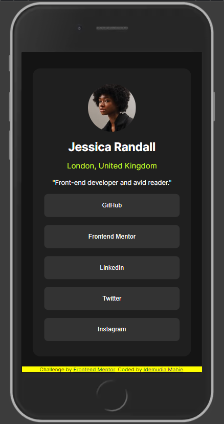
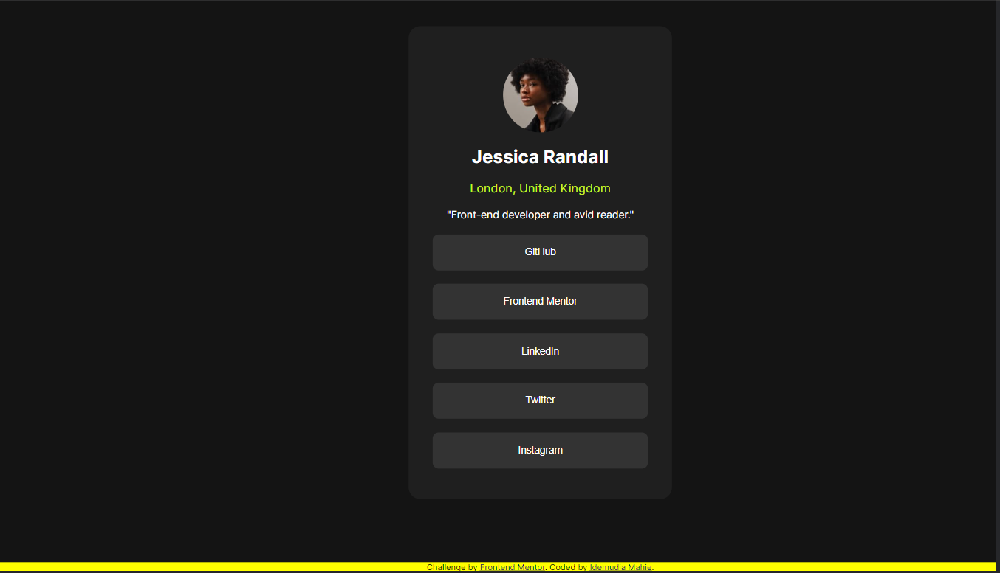

# Frontend Mentor - Social links profile solution

This is a solution to the [Social links profile challenge on Frontend Mentor](https://www.frontendmentor.io/challenges/social-links-profile-UG32l9m6dQ). Frontend Mentor challenges help you improve your coding skills by building realistic projects. 

## Table of contents

- [Overview](#overview)
  - [The challenge](#the-challenge)
  - [Screenshot](#screenshot)
- [My process](#my-process)
  - [Built with](#built-with)
  - [What I learned](#what-i-learned)
  - [Continued development](#continued-development)
  - [Useful resources](#useful-resources)
- [Author](#author)
- [Acknowledgments](#acknowledgments)


## Overview

### The challenge

Users should be able to:

- See hover and focus states for all interactive elements on the page

### Screenshot


The above links to a mobile view solution for the project.


The above links to a desktop view solution for the project.


## My process

### Built with

- Semantic HTML5 markup
- CSS custom properties
- Flexbox
- Mobile-first workflow
- CSS Variables
- CSS Transition


### What I learned

- I got to practice transition in CSS
```css
button:focus,
button:hover {
    background-color: var(--Green);
    color: var(--Off-Black);
    cursor: pointer;
    font-weight: 800;
    transition: all .9s .3s;
}
```

- I got to practice using true type font.
```css
@font-face {
    font-family: mahieInterFont;
    src: url(./assets/fonts/Inter-VariableFont_slnt\,wght.ttf);
}
```


### Continued development

- I worked on this project to help re-explain certain areas of css to a friend. It was an interesting project allbeit very simple for me. 

### Useful resources

- [Link to Mr. Dave Gray's Youtube Channel](https://www.youtube.com/@DaveGrayTeachesCode) - His videos can turn you to a full stack web developer.
- [Link to Mr. Dave Gray's CSS Tutorial](https://www.youtube.com/watch?v=n4R2E7O-Ngo) - This is an 11hrs video that can help you understand CSS better. It is about 11hrs long. Take your time.
- [Link to freeCodeCamp Youtube page](https://www.youtube.com/@freecodecamp) - This is a rich repository of knowledge. I found Mr. Gray here.

## Author

- email address - [idemudiamahie23@gmail.com]
- Twitter - [@mahie_id](https://twitter.com/mahie_id)

## Acknowledgments

- My deepest appreciation goes to Mr. Dave Gray whose tutorial videos has helped build my foundation in web development.
- I am also grateful to GMT Software whose coding bootcamp has given me environment and community of like-minded individuals to grow.
- I am also grateful to Miracle for making me work on this project with her.


## Date of Completion : April 10th, 2024.